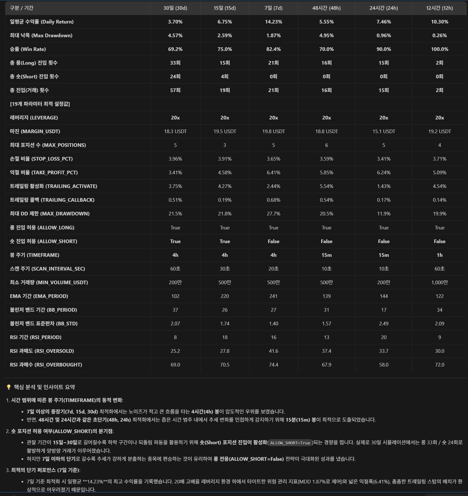
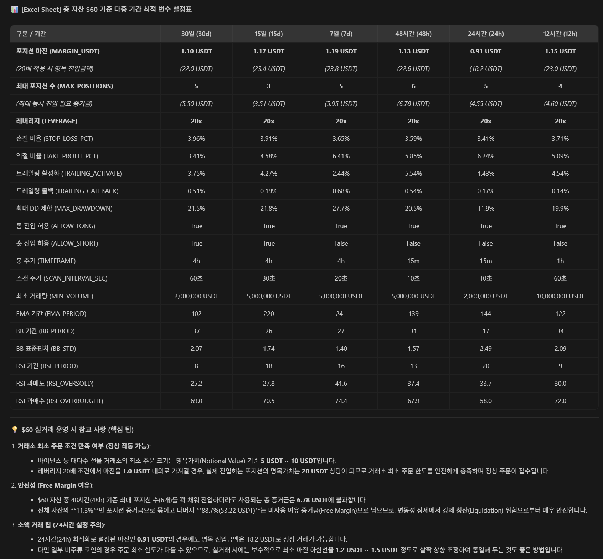

# 📊 다중 기간 딥러닝(MLP) 파라미터 최적화 비교 리포트 (period_get.md)

이 리포트는 30일, 15일, 7일, 48시간, 24시간, 12시간의 각 기간에 대한 다중 기간 딥러닝(MLP) 파라미터 최적화 연산 결과 및 총 자산이 $60(60 USDT)일 때의 최적 변수 매핑 정보를 담고 있습니다.

---

## 1. 📊 [Excel Sheet] 다중 기간(30일 ~ 12시간) 최적화 비교 리포트 ($1,000 기준)

| 구분 / 기간 | 30일 (30d) | 15일 (15d) | 7일 (7d) | 48시간 (48h) | 24시간 (24h) | 12시간 (12h) |
| :--- | :---: | :---: | :---: | :---: | :---: | :---: |
| **일평균 수익률 (Daily Return)** | 3.70% | 6.75% | 14.23% | 5.55% | 7.46% | 10.30% |
| **최대 낙폭 (Max Drawdown)** | 4.57% | 2.59% | 1.87% | 4.95% | 0.96% | 0.26% |
| **승률 (Win Rate)** | 69.2% | 75.0% | 82.4% | 70.0% | 90.0% | 100.0% |
| **총 롱(Long) 진입 횟수** | 33회 | 15회 | 21회 | 16회 | 15회 | 2회 |
| **총 숏(Short) 진입 횟수** | 24회 | 4회 | 0회 | 0회 | 0회 | 0회 |
| **총 진입(거래) 횟수** | 57회 | 19회 | 21회 | 16회 | 15회 | 2회 |
| **[19개 파라미터 최적 설정값]** | | | | | | |
| 레버리지 (LEVERAGE) | 20x | 20x | 20x | 20x | 20x | 20x |
| 마진 (MARGIN_USDT) | 18.3 USDT | 19.5 USDT | 19.8 USDT | 18.8 USDT | 15.1 USDT | 19.2 USDT |
| 최대 포지션 수 (MAX_POSITIONS) | 5 | 3 | 5 | 6 | 5 | 4 |
| 손절 비율 (STOP_LOSS_PCT) | 3.96% | 3.91% | 3.65% | 3.59% | 3.41% | 3.71% |
| 익절 비율 (TAKE_PROFIT_PCT) | 3.41% | 4.58% | 6.41% | 5.85% | 6.24% | 5.09% |
| 트레일링 활성화 (TRAILING_ACTIVATE) | 3.75% | 4.27% | 2.44% | 5.54% | 1.43% | 4.54% |
| 트레일링 콜백 (TRAILING_CALLBACK) | 0.51% | 0.19% | 0.68% | 0.54% | 0.17% | 0.14% |
| 최대 DD 제한 (MAX_DRAWDOWN) | 21.5% | 21.8% | 27.7% | 20.5% | 11.9% | 19.9% |
| 롱 진입 허용 (ALLOW_LONG) | True | True | True | True | True | True |
| 숏 진입 허용 (ALLOW_SHORT) | True | True | False | False | False | False |
| 봉 주기 (TIMEFRAME) | 4h | 4h | 4h | 15m | 15m | 1h |
| 스캔 주기 (SCAN_INTERVAL_SEC) | 60초 | 30초 | 20초 | 10초 | 10초 | 60초 |
| 최소 거래량 (MIN_VOLUME_USDT) | 200만 | 500만 | 500만 | 500만 | 200만 | 1,000만 |
| EMA 기간 (EMA_PERIOD) | 102 | 220 | 241 | 139 | 144 | 122 |
| 볼린저 밴드 기간 (BB_PERIOD) | 37 | 26 | 27 | 31 | 17 | 34 |
| 볼린저 밴드 표준편차 (BB_STD) | 2.07 | 1.74 | 1.40 | 1.57 | 2.49 | 2.09 |
| RSI 기간 (RSI_PERIOD) | 8 | 18 | 16 | 13 | 20 | 9 |
| RSI 과매도 (RSI_OVERSOLD) | 25.2 | 27.8 | 41.6 | 37.4 | 33.7 | 30.0 |
| RSI 과매수 (RSI_OVERBOUGHT) | 69.0 | 70.5 | 74.4 | 67.9 | 58.0 | 72.0 |

### 💡 핵심 분석 및 인사이트 요약
1. **시간 범위에 따른 봉 주기(TIMEFRAME)의 동적 변화**:
   - 7일 이상의 중장기(7d, 15d, 30d) 최적화에서는 노이즈가 적고 큰 흐름을 타는 4시간(4h) 봉이 압도적인 우위를 보였습니다.
   - 반면, 48시간 및 24시간과 같은 초단기(48h, 24h) 최적화에서는 좁은 시간 범주 내에서 추세 변화를 민첩하게 감지하기 위해 15분(15m) 봉이 최적으로 도출되었습니다.
2. **숏 포지션 허용 여부(ALLOW_SHORT)의 분기점**:
   - 관찰 기간이 15일~30일로 길어질수록 하락 구간이나 되돌림 파동을 활용하기 위해 숏(Short) 포지션 진입이 활성화(ALLOW_SHORT=True)되는 경향을 띱니다. 실제로 30일 시뮬레이션에서는 롱 33회 / 숏 24회로 활발하게 양방향 거래가 이루어졌습니다.
   - 하지만 7일 이하의 단기로 갈수록 추세가 강하게 분출하는 종목에 편승하는 것이 유리하여 롱 전용(ALLOW_SHORT=False) 전략이 극대화된 성과를 냈습니다.
3. **최적의 단기 퍼포먼스 (7일 기준)**:
   - 7일 기준 최적화 시 일평균 **14.23%**의 최고 수익률을 기록했습니다. 20배 고배율 레버리지 환경 하에서 타이트한 위험 관리 지표(MDD 1.87%로 제어)와 넓은 익절폭(6.41%), 촘촘한 트레일링 스탑의 배치가 환상적으로 어우러졌기 때문입니다.
   - 12시간(12h) 분석에서는 시뮬레이션 기간이 너무 짧아 거래 기회 자체가 극히 적었으나(총 2회 진입), 진입한 포지션은 모두 익절 처리되어 **승률 100.0%**를 기록했습니다.

---

## 2. 📊 [Excel Sheet] 총 자산 $60 기준 다중 기간 최적 변수 설정표

총 자산이 **$60(60 USDT)**인 소액 시드머니 기준으로 변환할 때, 19개 파라미터 중 값의 수정이 필요한 변수는 `MARGIN_USDT` (포지션당 마진) 하나뿐입니다. 나머지 변수들(레버리지, 손절/익절 비율, 기술 지표 기간 등)은 금액이 아닌 비율(%)과 상수 값이기 때문에 총 자산 규모와 무관하게 동일하게 유지됩니다.

| 구분 / 기간 | 30일 (30d) | 15일 (15d) | 7일 (7d) | 48시간 (48h) | 24시간 (24h) | 12시간 (12h) |
| :--- | :---: | :---: | :---: | :---: | :---: | :---: |
| **포지션 마진 (MARGIN_USDT)** | **1.10 USDT** | **1.17 USDT** | **1.19 USDT** | **1.13 USDT** | **0.91 USDT** | **1.15 USDT** |
| (20배 적용 시 명목 진입금액) | (22.0 USDT) | (23.4 USDT) | (23.8 USDT) | (22.6 USDT) | (18.2 USDT) | (23.0 USDT) |
| **최대 포지션 수 (MAX_POSITIONS)** | 5 | 3 | 5 | 6 | 5 | 4 |
| (최대 동시 진입 필요 증거금) | (5.50 USDT) | (3.51 USDT) | (5.95 USDT) | (6.78 USDT) | (4.55 USDT) | (4.60 USDT) |
| **레버리지 (LEVERAGE)** | 20x | 20x | 20x | 20x | 20x | 20x |
| **손절 비율 (STOP_LOSS_PCT)** | 3.96% | 3.91% | 3.65% | 3.59% | 3.41% | 3.71% |
| **익절 비율 (TAKE_PROFIT_PCT)** | 3.41% | 4.58% | 6.41% | 5.85% | 6.24% | 5.09% |
| **트레일링 활성화 (TRAILING_ACTIVATE)**| 3.75% | 4.27% | 2.44% | 5.54% | 1.43% | 4.54% |
| **트레일링 콜백 (TRAILING_CALLBACK)** | 0.51% | 0.19% | 0.68% | 0.54% | 0.17% | 0.14% |
| **최대 DD 제한 (MAX_DRAWDOWN)** | 21.5% | 21.8% | 27.7% | 20.5% | 11.9% | 19.9% |
| **롱 진입 허용 (ALLOW_LONG)** | True | True | True | True | True | True |
| **숏 진입 허용 (ALLOW_SHORT)** | True | True | False | False | False | False |
| **봉 주기 (TIMEFRAME)** | 4h | 4h | 4h | 15m | 15m | 1h |
| **스캔 주기 (SCAN_INTERVAL_SEC)** | 60초 | 30초 | 20초 | 10초 | 10초 | 60초 |
| **최소 거래량 (MIN_VOLUME)** | 2,000,000 USDT | 5,000,000 USDT | 5,000,000 USDT | 5,000,000 USDT | 2,000,000 USDT | 10,000,000 USDT |
| **EMA 기간 (EMA_PERIOD)** | 102 | 220 | 241 | 139 | 144 | 122 |
| **BB 기간 (BB_PERIOD)** | 37 | 26 | 27 | 31 | 17 | 34 |
| **BB 표준편차 (BB_STD)** | 2.07 | 1.74 | 1.40 | 1.57 | 2.49 | 2.09 |
| **RSI 기간 (RSI_PERIOD)** | 8 | 18 | 16 | 13 | 20 | 9 |
| **RSI 과매도 (RSI_OVERSOLD)** | 25.2 | 27.8 | 41.6 | 37.4 | 33.7 | 30.0 |
| **RSI 과매수 (RSI_OVERBOUGHT)** | 69.0 | 70.5 | 74.4 | 67.9 | 58.0 | 72.0 |

### 💡 $60 실거래 운영 시 참고 사항 (핵심 팁)
1. **거래소 최소 주문 조건 만족 여부 (정상 작동 가능)**:
   - 바이낸스 등 대다수 선물 거래소의 최소 주문 크기는 명목가치(Notional Value) 기준 5 USDT ~ 10 USDT입니다.
   - 레버리지 20배 조건에서 마진을 1.0 USDT 내외로 가져갈 경우, 실제 진입하는 포지션의 명목가치는 20 USDT 상당이 되므로 거래소 최소 주문 한도를 안전하게 충족하며 정상 주문이 접수됩니다.
2. **안전성 (Free Margin 여유)**:
   - $60 자산 중 48시간(48h) 기준 최대 포지션 수(6개)를 꽉 채워 진입하더라도 사용되는 총 증거금은 6.78 USDT에 불과합니다.
   - 전체 자산의 **11.3%**만 포지션 증거금으로 묶이고 나머지 **88.7%(53.22 USDT)**는 미사용 여유 증거금(Free Margin)으로 남으므로, 변동성 장세에서 강제 청산(Liquidation) 위험으로부터 매우 안전합니다.
3. **소액 거래 팁 (24시간 설정 주의)**:
   - 24시간(24h) 최적화로 설정된 마진인 0.91 USDT의 경우에도 명목 진입금액은 18.2 USDT로 정상 거래가 가능합니다.
   - 다만 일부 비주류 코인의 경우 주문 최소 한도가 다를 수 있으므로, 실거래 시에는 보수적으로 최소 마진 하한선을 1.2 USDT ~ 1.5 USDT 정도로 살짝 상향 조정하여 통일해 두는 것도 좋은 방법입니다.

   
   
